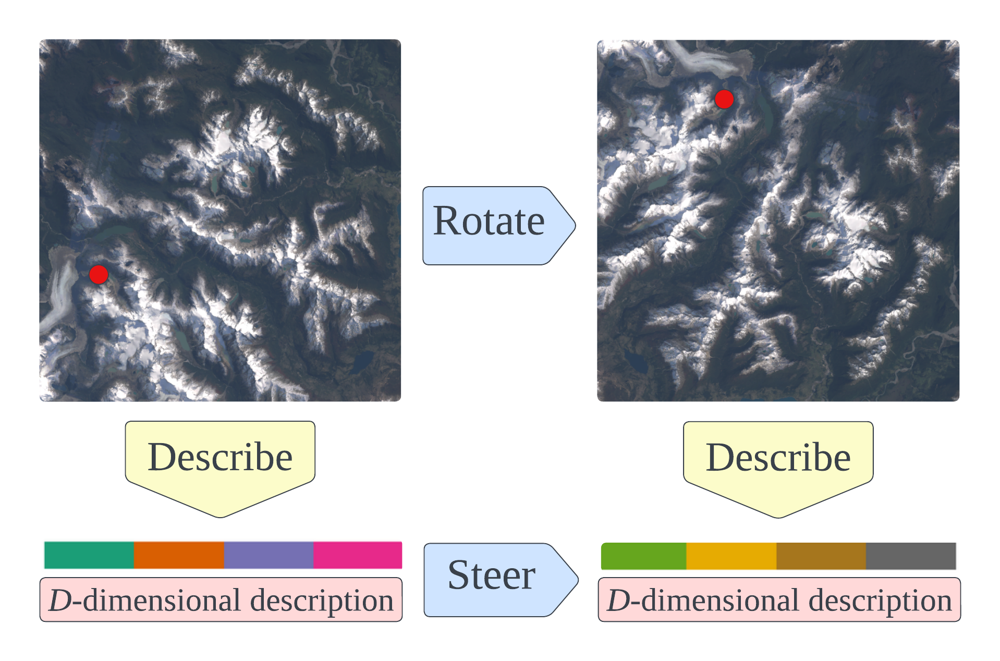
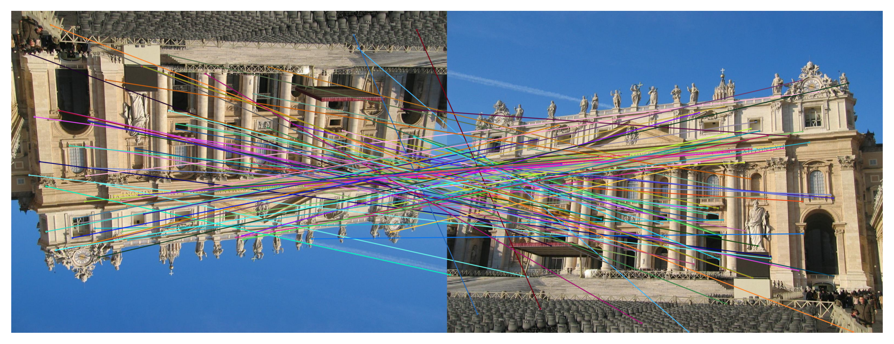
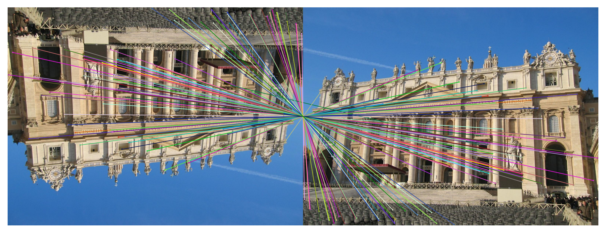
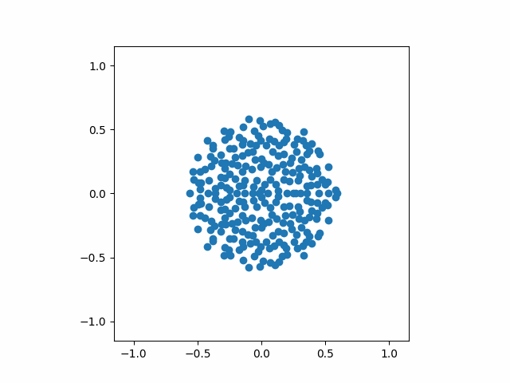
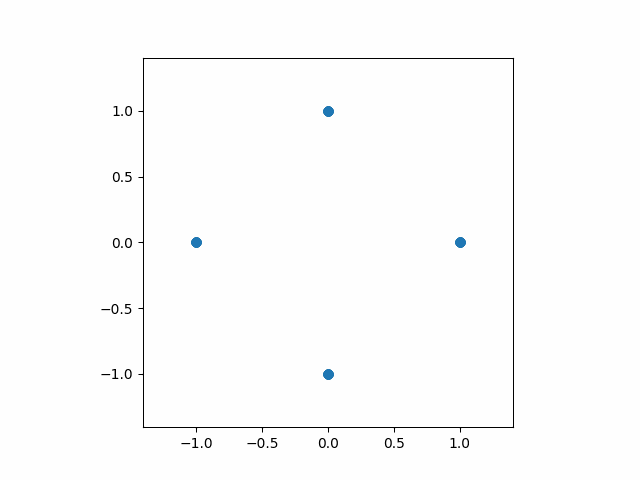
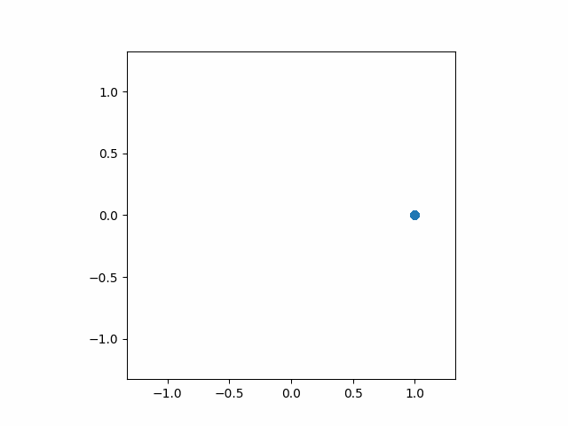
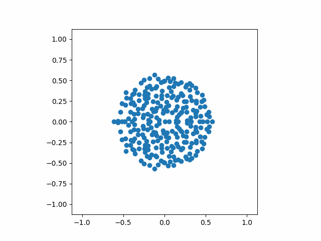
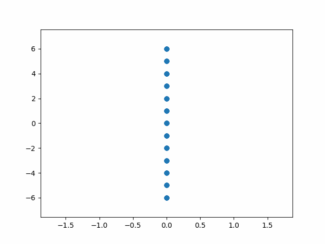

Steerers: A framework for rotation equivariant keypoint descriptors
---
TODO: paper link

A steerer is a linear map that modifies keypoint descriptions as if they were obtained from a rotated image. More info [below](#short-summary).



For running the code, create a new virtual environment of your preference (e.g. conda) with `python>=3.9`, `jupyter notebook` and GPU-enabled PyTorch.
Then install the `rotation_steerers` package using pip (this automatically installs DeDoDe from GitHub as well, see `setup.py`): 
```
pip install .
```
The weights are uploaded to [releases](https://github.com/georg-bn/rotation-steerers/releases). To download model weights needed for the demo and put them in a new folder `model_weights`, run
```
bash download_weights.sh
```
Matching example using a steerer:
```python
from PIL import Image
from DeDoDe import dedode_detector_L, dedode_descriptor_B
from rotation_steerers.steerers import DiscreteSteerer, ContinuousSteerer
from rotation_steerers.matchers.max_similarity import MaxSimilarityMatcher, ContinuousMaxSimilarityMatcher

im_A_path = "example_images/im_A_rot.jpg"
im_B_path = "example_images/im_B.jpg"
im_A = Image.open(im_A_path)
im_B = Image.open(im_B_path)
w_A, h_A = im_A.size
w_B, h_B = im_B.size

# Detection of keypoints (as for ordinary DeDoDe)
detector = dedode_detector_L(weights=torch.load("model_weights/dedode_detector_L.pth"))
detections_A = detector.detect_from_path(im_A_path, num_keypoints = 10_000)
keypoints_A, P_A = detections_A["keypoints"], detections_A["confidence"]
detections_B = detector.detect_from_path(im_B_path, num_keypoints = 10_000)
keypoints_B, P_B = detections_B["keypoints"], detections_B["confidence"]

# We show three example matching strategies here (comment/uncomment as required)
# C4-steering
descriptor = dedode_descriptor_B(weights=torch.load("model_weights/B_C4_Perm_descriptor_setting_C.pth"))
steerer = DiscreteSteerer(generator=torch.load("model_weights/B_C4_Perm_steerer_setting_C.pth"))
matcher = MaxSimilarityMatcher(steerer=steerer, steerer_order=4)

# # C8-steering with discretized steerer (recommended)
# descriptor = dedode_descriptor_B(weights=torch.load("model_weights/B_SO2_Spread_descriptor_setting_B.pth"))
# steerer = DiscreteSteerer(
#     generator=torch.matrix_exp(
#         0.25*3.1415*torch.load("model_weights/B_SO2_Spread_steerer_setting_B.pth")
#     )
# )

# # SO(2)-steering with arbitrary angles (not recommended, but fun)
# descriptor = dedode_descriptor_B(weights=torch.load("model_weights/B_SO2_Spread_descriptor_setting_B.pth"))
# steerer = ContinuousSteerer(generator=torch.load("model_weights/B_SO2_Spread_steerer_setting_B.pth"))
# matcher = ContinuousMaxSimilarityMatcher(steerer=steerer, angles=[0.2, 1.2879, 3.14])

# Match descriptions (API as in DeDoDe)
matches_A, matches_B, batch_ids = matcher.match(
    keypoints_A, descriptions_A,
    keypoints_B, descriptions_B,
    P_A = P_A, P_B = P_B,
    normalize = True, inv_temp=20, threshold = 0.01
)
matches_A, matches_B = matcher.to_pixel_coords(
    matches_A, matches_B, 
    h_A, w_A, h_B, w_B,
)
```

See the example notebook [demo.ipynb](demo.ipynb) for more simple matching examples.

We will publish training code and further model weights shortly.

## Short summary
A steerer is a linear map that modifies keypoint descriptions as if they were obtained from a rotated image.
So a steerer makes the keypoint descriptor equivariant.
This provides a computational shortcut as we don't have to rerun our descriptor for every rotation of the image.
Below we show matches from original DeDoDe descriptions, and DeDoDe descriptions multiplied by a steerer:

 



Hence, steerers are useful practically. But they are also interesting conceptually: Steerers can be found for arbitrary given descriptors, even such that are trained without any rotation augmentation (we explain why in the paper). Further, steerers can be trained jointly with a descriptor, enabling rotation augmentation without degrading performance on upright images (we get interesting training dynamics, see [below](#evolution-of-eigenvalues-of-the-steerer-during-training) and Section 5.5 of the paper). Similarly we can fix a steerer and train a descriptor given the steerer. All these three settings are explored in our paper.

We consider steerers for the group C4 of quarter turn rotations as well as the full rotation group SO(2). The first case is useful practically to align images upright and the second for completely rotation invariant matching.

## Evolution of eigenvalues of the steerer during training

Here we provide the gif version of Figure 4 in the paper. We show how the eigenvalues of the steerer evolve in the complex plane during training when we train the steerer and descriptor jointly. The first three correspond to a C4-steerer and the last two show the Lie algebra generator of an SO(2)-steerer.



## Citation
```
TODO
```

## License
Our code has an MIT license. DeDoDe-G uses a DINOv2 backbone which has an Apache-2 license.
